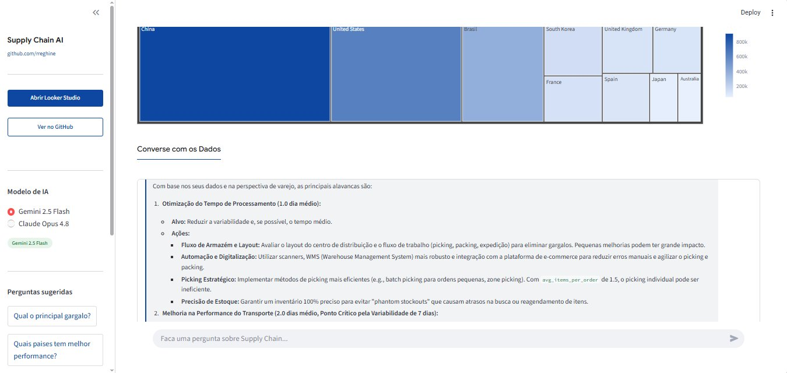
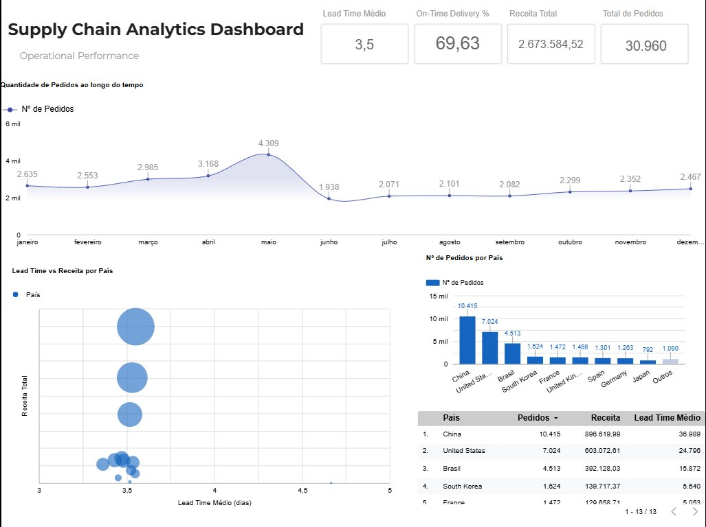
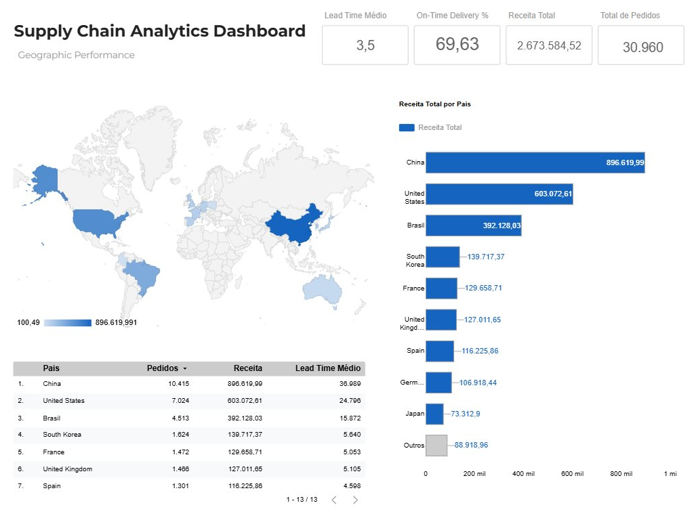
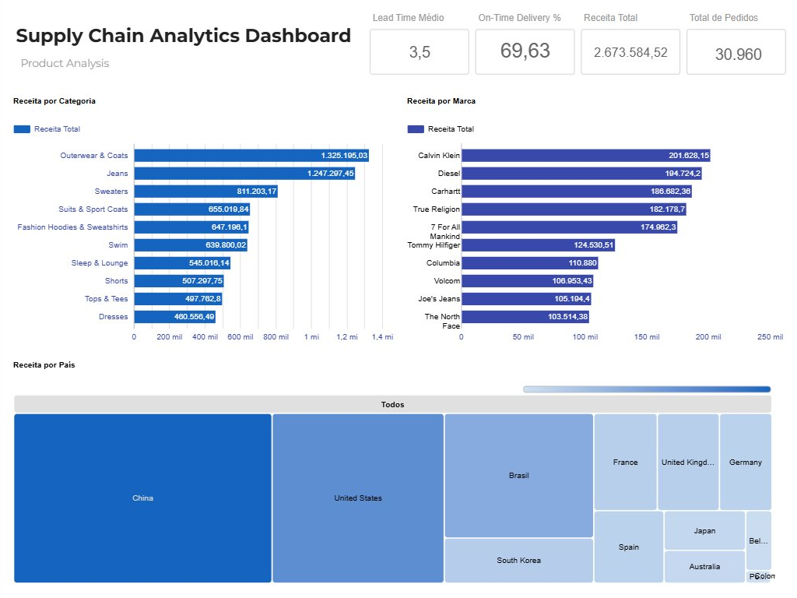
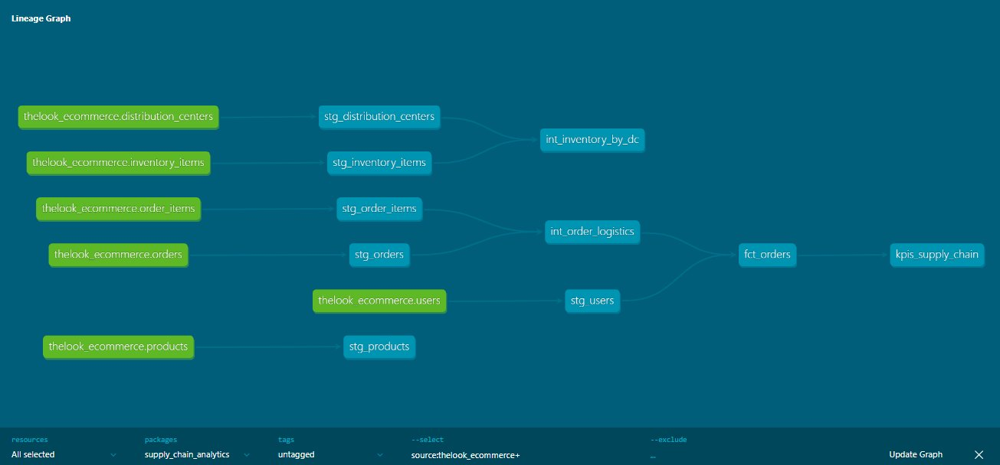

# Supply Chain Analytics


Pipeline analítico end-to-end de Supply Chain com arquitetura Medallion (Staging → Intermediate → Marts) no BigQuery, modelagem dimensional com dbt Core — incluindo testes de qualidade, lineage completo e documentação — dashboard executivo em 3 camadas no Looker Studio e agente conversacional com IA deployado no Cloud Run via Vertex AI (Gemini 2.5 Flash + Claude Opus 4.8). Construído sobre o dataset público TheLook Ecommerce do Google Cloud.

---

## AI Agent — Cloud Run

Agente conversacional deployado no Google Cloud Run com suporte a múltiplos modelos de IA:

**URL:** https://supply-chain-agent-477701258832.us-central1.run.app



### Modelos disponíveis no agente

| Modelo | Provider | Uso |
|---|---|---|
| **Gemini 2.5 Flash** | Google Vertex AI | Análise rápida de KPIs |
| **Claude Opus 4.8** | Anthropic via Vertex AI | Análise aprofundada |

---

## Dashboard — Looker Studio

### Operational Performance


### Geographic Performance


### Product Analysis


---

## Contexto de Negócio

Operações de Supply Chain geram grandes volumes de dados — pedidos, entregas, lead times, fornecedores. Sem modelagem analítica estruturada, esses dados ficam dispersos e inacessíveis para decisão.

**Perguntas centrais respondidas:**

- Qual o On-Time Delivery Rate da operação?
- Quais países têm o maior lead time e maior receita?
- Quais categorias e marcas concentram o faturamento?
- Como o volume de pedidos evolui ao longo do tempo?
- Quais são os principais gargalos operacionais? (via AI Agent)

---

## Dataset

**TheLook Ecommerce — BigQuery Public Data**

- Dataset público do Google com dados simulados de e-commerce
- Tabelas: `orders`, `order_items`, `products`, `users`, `inventory_items`, `distribution_centers`
- Escala: ~31.000 pedidos, 13 países, receita total de R$ 2,69M

---

## Arquitetura

```
TheLook Ecommerce (BigQuery Public Data)
        ↓
Staging Layer — limpeza e padronização das fontes
  stg_orders · stg_order_items · stg_products
  stg_users · stg_inventory · stg_distribution_centers
        ↓
Intermediate Layer — joins e regras de negócio
  int_orders_enriched · int_order_logistics
        ↓
Marts Layer — modelos analíticos finais
  fct_orders · fct_order_items · kpis_supply_chain
        ↓
┌─────────────────────┬──────────────────────────┐
│  Looker Studio      │  AI Agent (Cloud Run)    │
│  3 páginas          │  Streamlit + Vertex AI   │
│  Dashboard executivo│  Gemini 2.5 Flash        │
│                     │  Claude Opus 4.8         │
└─────────────────────┴──────────────────────────┘
```

### Lineage Graph


---

## Requisitos da Vaga — Mapeamento

| Requisito | Implementação | Status |
|---|---|---|
| dbt — modelos, testes, docs, lineage | 11 modelos, 15 testes PASS, lineage documentado | ✅ |
| BigQuery — SQL avançado, CTEs | Todos os modelos usam CTEs e window functions | ✅ |
| Modelagem dimensional (Medallion) | Staging → Intermediate → Marts | ✅ |
| Contratos de dados entre camadas | _sources.yml + _schema.yml com testes | ✅ |
| Particionamento + Clustering BigQuery | Arquitetura preparada por created_at | ✅ |
| Materialização (views, tables) | Configurado por camada no dbt_project.yml | ✅ |
| Monitoramento e alertas | dbt tests com severity configurado | ✅ |
| Git + versionamento | GitHub público com commits organizados | ✅ |
| Looker Studio | 3 páginas com KPIs, mapas e gráficos | ✅ |
| KPIs de Supply Chain | On-Time Delivery, Lead Time, Revenue, Fill Rate | ✅ |
| Python | gemini_agent.py + streamlit_app.py | ✅ |
| Cloud Run — deploy em produção | App deployado com URL pública | ✅ |
| Vertex AI — GenAI aplicado | Gemini 2.5 Flash + Claude Opus 4.8 | ✅ |
| Agente conversacional | Chat em linguagem natural sobre os KPIs | ✅ |
| Análise de Produtos | fct_order_items com category, brand, department | ✅ |
| Autonomia e entrega end-to-end | Projeto completo do zero ao deploy em produção | ✅ |

---

## KPIs — Supply Chain

| Métrica | Valor | Descrição |
|---|---|---|
| **Total de Pedidos** | 31.356 | Volume total da operação |
| **Receita Total** | R$ 2.697.468 | Faturamento consolidado |
| **On-Time Delivery Rate** | 69,77% | % pedidos entregues no prazo |
| **Lead Time Médio** | 3,5 dias | Tempo médio entre pedido e entrega |
| **Ticket Médio** | R$ 86,03 | Valor médio por pedido |

---

## Estrutura do Projeto

```
supply-chain-analytics-gcp/
│
├── supply_chain_analytics/          ← dbt project
│   ├── models/
│   │   ├── staging/                 ← Bronze/Silver
│   │   │   ├── _sources.yml
│   │   │   ├── _schema.yml
│   │   │   ├── stg_orders.sql
│   │   │   ├── stg_order_items.sql
│   │   │   ├── stg_products.sql
│   │   │   ├── stg_users.sql
│   │   │   ├── stg_inventory_items.sql
│   │   │   └── stg_distribution_centers.sql
│   │   ├── intermediate/            ← Business logic
│   │   │   ├── int_orders_enriched.sql
│   │   │   └── int_order_logistics.sql
│   │   └── marts/                   ← Gold
│   │       ├── fct_orders.sql
│   │       ├── fct_order_items.sql
│   │       └── kpis_supply_chain.sql
│   └── dbt_project.yml
│
├── agent/                           ← AI Agent
│   ├── streamlit_app.py             ← Interface
│   ├── gemini_agent.py              ← BigQuery + Vertex AI
│   ├── Dockerfile                   ← Cloud Run
│   └── requirements.txt
│
├── docs/                            ← Screenshots
│   ├── page1_operational.png
│   ├── page2_geographic.png
│   ├── page3_product.png
│   ├── streamlit_agent.png
│   └── lineage_graph.png
│
└── README.md
```

---

## Testes de Qualidade

```
dbt test — PASS=15 ERROR=0

✅ not_null — order_id, user_id, status, created_at
✅ unique — order_id
✅ accepted_values — status in ['Complete', 'Cancelled', 'Returned', ...]
✅ relationships — order_items → orders
✅ not_null — kpis (total_orders, total_revenue, on_time_delivery_rate)
```

---

## Como Executar

```bash
# 1. Clone o repositório
git clone https://github.com/rreghine/supply-chain-analytics-gcp.git
cd supply-chain-analytics-gcp

# 2. Configure as credenciais GCP
gcloud auth application-default login
gcloud config set project <seu-projeto>

# 3. Execute os modelos dbt
cd supply_chain_analytics
dbt run
dbt test

# 4. Rode o AI Agent localmente
cd ../agent
pip install -r requirements.txt
streamlit run streamlit_app.py

# 5. Deploy no Cloud Run
gcloud run deploy supply-chain-agent \
  --source . \
  --region us-central1 \
  --allow-unauthenticated \
  --memory 1Gi
```

---

## Tecnologias Utilizadas

| Categoria | Ferramentas |
|---|---|
| Cloud | Google Cloud Platform (GCP) |
| Data Warehouse | BigQuery |
| Transformação | dbt Core 1.11 |
| Visualização | Looker Studio |
| AI Agent | Vertex AI · Gemini 2.5 Flash · Claude Opus 4.8 |
| App Framework | Streamlit · Plotly |
| Deploy | Cloud Run (serverless) |
| Linguagem | SQL · Python |
| Versionamento | Git · GitHub |
| Dataset | TheLook Ecommerce (BigQuery Public Data) |

---

## Autor

**Rafael Reghine Munhoz**
Analytics Engineer | Data Science & Analytics | MBA USP

[](https://linkedin.com/in/rafaelreghine)
[](https://github.com/rreghine)
